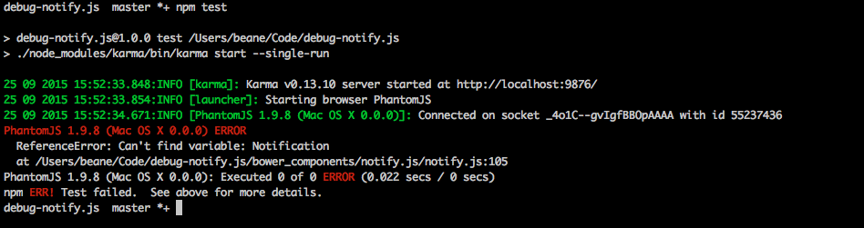

POC for issue here: https://github.com/alexgibson/notify.js/issues/42

Where notify.js does not work with karma and PhantomJS.
There are no spec files because the error occurs as soon as notify is loaded by karma and Phantom.

Setup instructions:
get npm and node: https://nodejs.org/en/download/
In your terminal application:
git clone https://github.com/ErikBean/debug-notify.js.git
cd to project dir
npm install
bower install
npm test

should see output similar to this:

